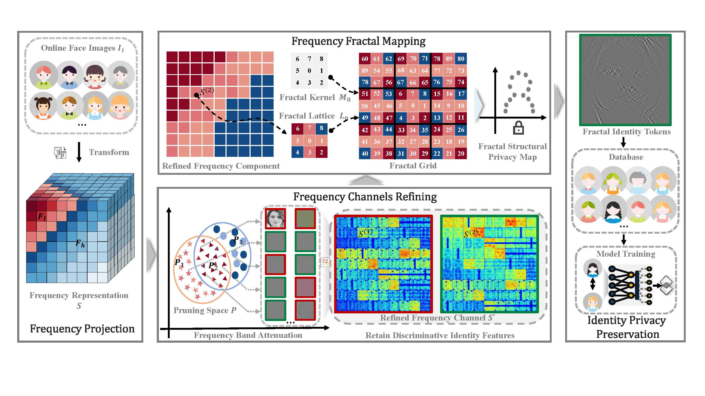

# FracFace

## Introduction
A fractal-based privacy-preserving face recognition framework. It disrupts exploitable visual clues in the frequency domain while retaining identity-discriminative features. With frequency channel refining and fractal remapping modules, FracFace enhances resistance to reconstruction attacks and achieves strong recognition performance across public benchmarks. See details below.  

Key Words: Privacy Preserving, Facial Recognition, Fractal, Visual Privacy, Defending Reconstruction Attack.
### Paper Details
#### Abstract
Face recognition is essential for identity authentication, but the rich visual clues in facial images pose significant privacy risks, highlighting the critical importance of privacy-preserving solutions. For instance, numerous studies have shown that generative models are capable of effectively performing reconstruction attacks that result in the restoration of original visual clues. To mitigate this threat, we introduce FracFace, a fractal-based privacy-preserving face recognition framework. This approach effectively weakens the visual clues that can be exploited by reconstruction attacks by disrupting the spatial structure in frequency domain features, while retaining the vital visual clues required for identity recognition. To achieve this, we craft a Frequency Channels Refining module that reduces sparsity in the frequency domain. It suppresses visual clues that could be exploited by reconstruction attacks, while preserving features indispensable for recognition, thus making these attacks more challenging. More significantly, we design a Frequency Fractal Mapping module that obfuscates deep representations by remapping refined frequency channels into a fractal-based privacy structure. By leveraging the self-similarity of fractals, this module enhances both recognition performance and defense strength, thereby significantly improving the overall robustness of the protection scheme. Experiments conducted on multiple public face recognition benchmarks demonstrate that the proposed FracFace significantly reduces the visual recoverability of facial features, while maintaining high recognition accuracy, as well as the superiorities over state-of-the-art privacy protection approaches.
#### Notice
We will continue to optimize and update this official code to ensure the reproducibility of this code.
## Requirements   
•	Torch 2.4.1  
•	Torchvision 0.19.1  
•	CUDA 12.4  
•	Torchjpeg 0.9.33  
## Installation
The code works with PyTorch = 2.4.1 and Python 3.10. This mainly depends on the CUDA version you want to match. First to install dependencies:
```bash
pip install -r requirements.txt 
```  

1)	Dataset  
•	Download the training dataset (e.g., https://www.kaggle.com/datasets/yakhyokhuja/ms1m-arcface-dataset?resource=download).   
•	Organize the dataset to match the structure required by FracFace. Prepare it to match FracFace's required form. Fill in the blanks in train.yaml with your prepared dataset's directory, index, and name:  
DATA_ROOT: '' # [To be the dataset's directory]''  
INDEX_ROOT: '' # [To be the index's directory]''  
DATASETS:  
name: [To be the dataset's name]  
Make sure the dataset contains cleaned and aligned face images with proper identity indexing.

2)	Data Processing
First, in order to train more smoothly, make sure the size of the training/testing images is 112*112. Secondly, perform frequency domain transformation on the training/testing images. Then, perform the Frequency Channels Refining and Frequency Fractal Mapping operations on all channels based on the frequency domain. You can try running
 ```bash
CUDA_VISIBLE_DEVICES=0 python data2npy.py

```  
The processing flow of Frequency Channels Refining and Frequency Fractal Mapping can be referred to running
```bash
CUDA_VISIBLE_DEVICES=0 python FracFace_demo.py
```

## Training
We recommend utilizing distributed training across multiple GPUs to accommodate the computational demands of the training process.

For training, run the 
```bash
CUDA_VISIBLE_DEVICES=0,1 torchrun --nproc_per_node=2 train.py
```
